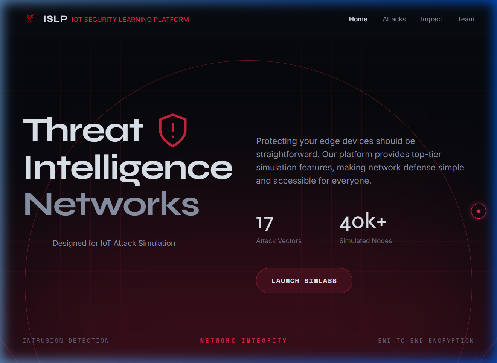
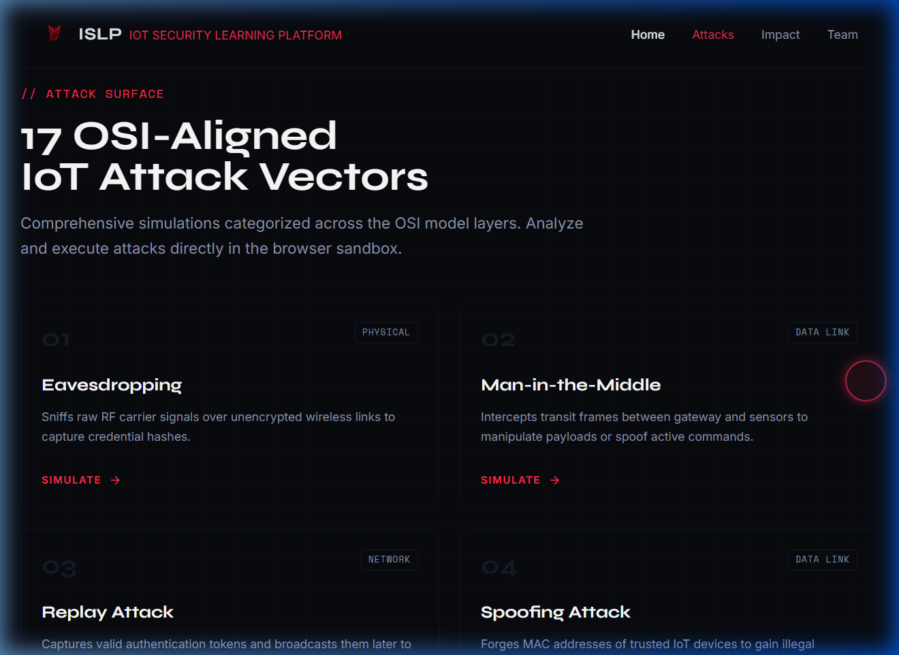

<div align="center">

<!-- Animated top banner -->


<!-- Logo -->


<!-- Animated typing headline -->
<a href="https://git.io/typing-svg"></a>

<br/>

<!-- Badges -->
[](https://react.dev)
[](https://threejs.org)
[](https://typescriptlang.org)
[](https://vitejs.dev)
[](https://greensock.com/gsap/)
[](https://nodejs.org)
[](https://espressif.com)
[](https://tailwindcss.com)

<br/>

**Built at the Department of Computer Science & Engineering, NITK Surathkal**

</div>

---

## 🖥️ Screenshots

<div align="center">

### Hero — Command Center Landing


### Attack Surface — 17 OSI-Aligned Vectors


</div>

---

## 🔴 Overview

ISLP is an interactive IoT security learning platform that simulates **17 real-world cyber-physical attack vectors** on a live 3D network topology. It bridges the gap between theoretical security concepts and hands-on understanding through a visually-rich, command-center-style interface — complete with a real hardware integration layer using ESP32 nodes communicating over ESP-NOW.

> *"The best way to understand a cyberattack is to execute one — safely."*

---

## ✨ Features

| Feature | Description |
|---|---|
| 🎯 **17 Attack Simulations** | Spanning all OSI layers — Physical to Application |
| 🌐 **3D Live Topology** | Interactive Three.js WebGL canvas with real-time packet flows |
| 🚀 **GSAP Boot Sequence** | Cinematic terminal-style loader on app start |
| 🖱️ **Custom Cursor Engine** | Framer Motion neon targeting-reticle with spring physics |
| 📋 **Attack Info Modals** | TL;DR + Technical Deep Dive explanation for every attack |
| 🔗 **Digital Twin Mode** | Sync with real ESP32 hardware via Node.js WebSocket bridge |
| 📊 **Device Registry** | Live node table — IP, MAC, role, and real-time status |
| 💉 **Payload Injection** | Send custom attack payloads to physical hardware from the UI |

---

## 🏗️ Tech Stack

```
Frontend  →  React 18 + Vite + TypeScript + Tailwind CSS
3D Engine →  Three.js (WebGL) + OrbitControls
Animation →  GSAP 3 + Framer Motion
Backend   →  Node.js + Express + Socket.IO
Hardware  →  ESP32 (ESP-NOW protocol, Arduino firmware)
```

---

## 📂 Project Structure

```
attack_sim_v2/
├── hero-app/                     # Main React application (Vite)
│   ├── public/legacy/            # Vanilla JS simulation engine
│   │   ├── app.js                # Main application controller
│   │   ├── three-topology.js     # 3D WebGL network renderer
│   │   ├── simulator.js          # Attack simulation logic
│   │   └── serial-gateway.js     # ESP32 hardware bridge
│   └── src/
│       ├── components/
│       │   ├── DashboardUI.tsx    # Main simulation dashboard
│       │   ├── HeroSection.tsx    # Landing hero section
│       │   ├── LandingSections.tsx# Attack cards, Impact, Team
│       │   ├── AttackInfoModal.tsx# Attack detail modals
│       │   ├── Loader.tsx         # GSAP boot sequence
│       │   └── CustomCursor.tsx   # Framer Motion cursor
│       └── App.tsx
├── server/                       # Node.js WebSocket bridge
├── docs/                         # Screenshots & assets
└── README.md
```

---

## 🚀 Getting Started

### 1. Install & Run Frontend

```bash
cd hero-app
npm install
npm run dev
```

Open **http://localhost:5173**

### 2. Start Hardware Bridge *(optional)*

```bash
cd server
node index.js
```

> Listens on port `3001` — bridges WebSocket ↔ ESP32 serial for real-time hardware control.

### 3. Production Build

```bash
cd hero-app
npm run build
```

---

## 🎯 Attack Vectors

<details>
<summary><b>Click to expand — all 17 simulated attacks</b></summary>

| # | Layer | Attack | TL;DR |
|---|---|---|---|
| 01 | Physical | **Eavesdropping** | Listening in on invisible radio waves to steal passwords |
| 02 | Data Link | **Man-in-the-Middle** | Secretly standing between two devices to change their messages |
| 03 | Network | **Replay Attack** | Recording a valid login code and using it again later |
| 04 | Data Link | **Spoofing Attack** | Pretending to be a trusted device by stealing its ID |
| 05 | Network | **Packet Injection** | Sneaking fake data packets into the network to cause chaos |
| 06 | Transport | **Denial of Service** | Overwhelming a single device with junk data until it crashes |
| 07 | Transport | **Distributed DoS** | Using an army of hacked devices to take down the network |
| 08 | Physical | **Jamming Attack** | Blasting radio noise so no devices can communicate |
| 09 | Application | **Credential Theft** | Stealing the master password database |
| 10 | Session | **Session Hijacking** | Taking over an active login session |
| 11 | Physical | **Rogue Insertion** | Plugging an evil, unverified device into the network |
| 12 | Network | **Routing Attack** | Messing with the network's GPS so data gets lost |
| 13 | Application | **Firmware Tampering** | Pushing a malicious software update to a device |
| 14 | Network | **ARP Poisoning** | Corrupting the address book to intercept traffic |
| 15 | Application | **SQL Injection** | Tricking a database into leaking all its secrets |
| 16 | Network | **DNS Spoofing** | Sending you to a fake website by lying about its address |
| 17 | Physical | **Physical Tampering** | Directly accessing and modifying the hardware itself |

</details>

---

## 🔧 Hardware Setup

Three ESP32 nodes form the cyber-physical digital twin:

```
┌─────────────────┐    ESP-NOW     ┌─────────────────┐
│   Node A        │ ─────────────► │   Node B        │
│ Parking Sender  │                │ Parking Receiver│
│ (RFID + Sensor) │                │ (OLED + Gate)   │
└─────────────────┘                └─────────────────┘
         │                                  │
         └──────────────────────────────────┘
                         ▲
               ┌─────────────────┐
               │   Attacker ESP  │
               │  (Promiscuous   │◄──── Web UI (Socket.IO)
               │   Sniffer)      │
               └─────────────────┘
```

---

## 👥 Team

<div align="center">

| Role | Name | LinkedIn |
|---|---|---|
| 🎓 Project Supervisor | **Dr. K. V. Gangadharan** | [](https://www.linkedin.com/in/kvganga/) |
| 🧑‍🏫 Project Mentor | **Alisha A Joy** | [](https://www.linkedin.com/in/alisha-joy25a/) |
| 💻 Lead Developer | **Rudranarayan** | [](https://www.linkedin.com/in/rudranarayan18) |
| 💻 Lead Developer | **Krishnendu Prasanth** | [](https://www.linkedin.com/in/krishnendu-prasanth) |

</div>

---

<div align="center">

**Department of Computer Science & Engineering**<br/>
National Institute of Technology Karnataka (NITK), Surathkal — 575025


</div>
